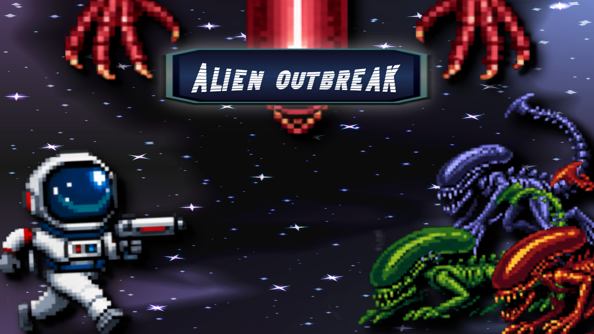
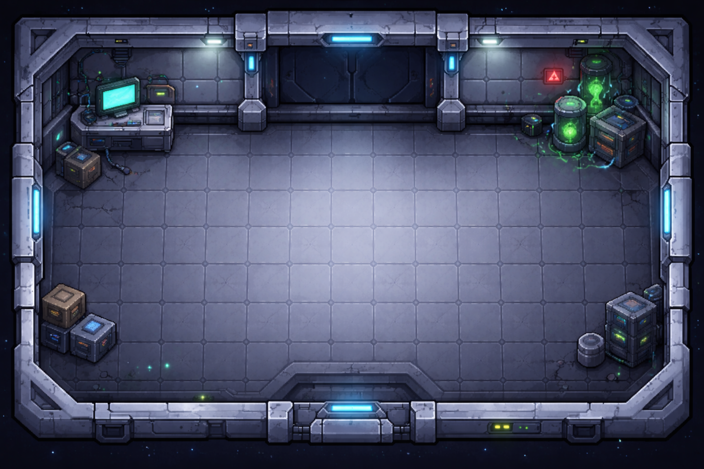
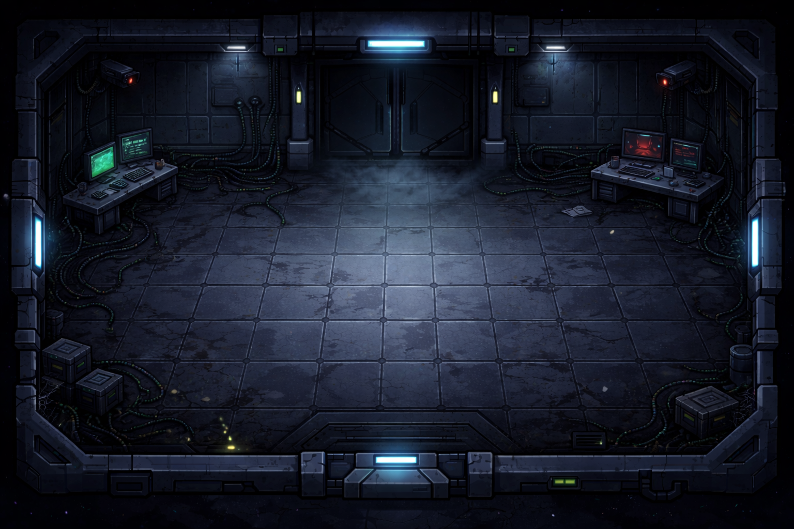
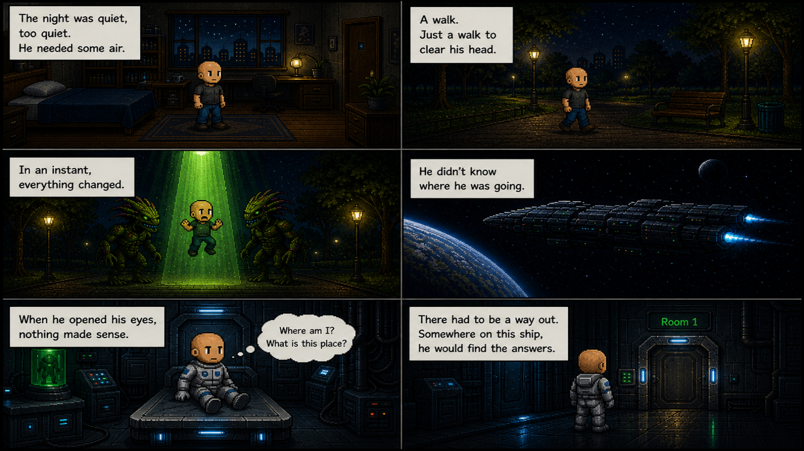
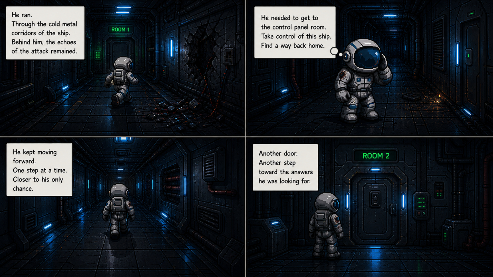

# 👾 Alien Outbreak

**Alien Outbreak** is a 2D survival action game built with **Python** and **Pygame**.  
Fight through alien-infested levels, survive enemy waves, defeat bosses, collect upgrades, and progress through story scenes.

<p align="center">
  
</p>

## 🎮 About the Game

Alien Outbreak combines fast movement, shooting, cooldown-based abilities, boss encounters, and story-driven level progression. The game includes custom menus, animated characters, sound effects, background music, pause/game-over screens, and configurable resolution/FPS settings.

The player must survive each level, manage health and cooldowns, avoid enemy contact, collect upgrades, and defeat level bosses to advance.

## ✨ Features

- 🧟 **Multiple enemy types** across different levels
- 👹 **Boss fights** with unique attack patterns
- 🧭 **Three playable levels** with progression and transitions
- 📖 **Story frames** before and after key moments
- 🔫 **Mouse-based shooting**
- ⚡ **Dash ability** for quick movement
- ❄️ **Area freeze ability** to slow enemies
- 🧪 **Random upgrades** for health, speed, and player size
- 🎵 **Music and sound effects** for menus, combat, abilities, and damage
- 🖥️ **HD/FHD resolution settings**
- ⏱️ **Configurable FPS options**
- ⏸️ **Pause menu**, settings menu, controls/rules menu, and game-over screen

## 🖼️ Preview

### Level Backgrounds

<p>
  
  
</p>

### Story Scenes

<p>
  
  
</p>

### Characters and Combat Assets

<p>
  
  
  
  
</p>

## 🕹️ Controls

| Action | Input |
| --- | --- |
| Move | `W` `A` `S` `D` |
| Shoot | Left mouse click |
| Dash | `E` |
| Area freeze | `Q` |
| Pause | `Esc` |
| Advance story frame | `Space`, `Enter`, `Esc`, or mouse click |

## 🧩 Project Structure

```text
GameDevProject/
├── Assets/                 # Sprites, backgrounds, story images, audio, and UI assets
├── Game/                   # Game logic and screens
│   ├── Level_1/            # Level 1 controller, enemies, and boss
│   ├── Level_2/            # Level 2 controller, enemies, and boss
│   ├── Level_3/            # Level 3 controller, enemies, and boss
│   ├── player.py           # Player movement, health, abilities, and UI
│   ├── gun.py              # Shooting/projectile logic
│   ├── upgrades.py         # Random upgrade pickups
│   ├── audio.py            # Music and sound effects
│   ├── menu.py             # Main menu
│   ├── menu_settings.py    # Settings menu
│   ├── menu_controls.py    # Controls/rules menu
│   ├── pause_menu.py       # Pause overlay
│   └── story_frames.py     # Story scene handling
├── main.py                 # Main game loop and state manager
├── requirements.txt        # Python dependencies
└── README.md
```

## ⚙️ Setup

This project is expected to run with **Python `3.13.3`**.

The repo includes a `.python-version` file for `pyenv` users. That file does not change Python by itself; it only tells `pyenv` which version to select when `pyenv` is installed and initialized in your shell.

> ⚠️ **Important:** Do not use Python `3.14` for this project. `pygame.mixer` had issues there during setup.

### 1. Install Python 3.13.3

If you use `pyenv`:

```bash
pyenv install 3.13.3
pyenv local 3.13.3
```

If you do not use `pyenv`, install Python `3.13.3` with your normal package manager or installer, then make sure `python` points to that version.

Check your Python version:

```bash
python --version
```

### 2. Create and Activate a Virtual Environment

Linux/macOS:

```bash
python -m venv venv
source venv/bin/activate
```

Windows PowerShell:

```powershell
python -m venv venv
.\venv\Scripts\Activate.ps1
```

### 3. Install Dependencies

```bash
pip install --upgrade pip
pip install -r requirements.txt
```

The main dependency is:

```text
pygame==2.6.1
```

### 4. Run the Game

```bash
python main.py
```

## 🛠️ Development Notes

- Game configuration is stored in `Game/settings.py`.
- `GLOBAL_DEV_MODE` can be used to show restricted areas and reduce enemy spawning while testing.
- Resolution options are currently `HD` and `FHD`.
- FPS options are currently `30`, `60`, and `120`.
- Level progress is tracked in memory through `LEVELS_COMPLETED`.

## 📌 Current Status

Alien Outbreak currently includes the core gameplay loop, menus, audio, story frames, three levels, player abilities, upgrades, and boss encounters. Future improvements could include persistent save data, more polished balancing, additional levels, and expanded UI feedback.

## 🚀 Tech Stack

- 🐍 Python
- 🎮 Pygame
- 🎨 Custom sprite, background, UI, story, and audio assets
